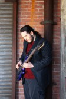
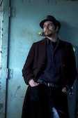
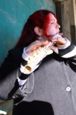
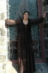
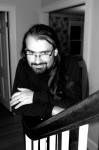

<h1 style="border-bottom: 1px black solid; text-align: right;">
  current lineup
</h1>

  <strong>Nat Budin</strong> – Guitar, cello & vocals

  Nat was classically trained as a cellist, but promptly recovered from all that as soon as he picked up a guitar.  He has previously performed in Klezmoratorium and <a href="http://crisiscenter.bandcamp.com">The Crisis Center</a>, and is helping <a href="http://www.sassafrassmusic.com">Sassafrass</a> produce their album <em>Sundown</em>.

  <strong>Jon Sagotsky</strong> – Bass & guitar

  Jon has no proper musical training, but does possess a modest collection of cheap and/or free guitars and an unhealthy obsession with Rush, which is almost as good.

  <strong>Brad Smith</strong> – Percussion & vocals

  Brad has been drumming and singing since high school. In addition to theater, larp, and other creative outlets, he is a principal voice actor and technical producer on the <a href="http://www.secondshiftpodcast.com">Second Shift</a> audio theater podcast.

  <strong>Alexandria Wilkie</strong> – Flute & vocals

  Alexandria is a classically trained flutist, who refuses to try music as a career, but keeps coming back to it in her off time. She has been seen in the wild making (and wearing) silly costumes, singing classical music, and walking across bridges in high winds.  She also performs with <a href="http://www.sassafrassmusic.com">Sassafrass</a>.

<h1 style="border-bottom: 1px black solid; text-align: right;">
  strangers in repose
</h1>

<strong>Susan Weiner</strong> – Band founder, composer, fiddle and vocals

Susan was raised by wild folk musicians and has been making music practically since birth.  She originally put together Stranger Ways in order to perform the many songs she’d written over the past couple decades. Susan moved to Iowa in mid-2011 for a post-graduate position, and currently performs with [Cheshire Moon][1] when she’s not collecting wasps on the open prairies.

<strong>Jesse Cox</strong> -<strong> </strong>Lead vocals

Jesse Cox has been described as an “unstoppable force of singing” in this sentence.  Having been raised on folk music, he soon graduated to musical theatre and has also frequently been sighted singing and cantoring in churches. Jesse was the lead vocalist in the original lineup of Stranger Ways. He left the band to pursue a nursing degree and to raise his first child.

*Photos of Nat, Brad, Alexandria, Jon and Jesse by Viktoriya Fuzaylova. Photo of Susan by Scott Lefton.*

 [1]: http://www.cheshiremoonband.com/